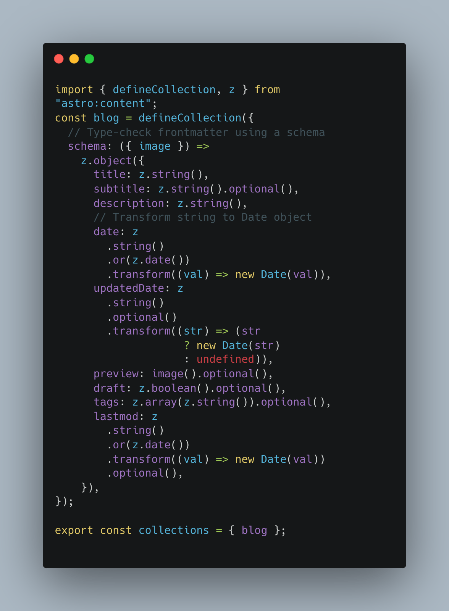

ก่อนหน้านี้ผมใช้ Gatsby.js ในการทำเว็บบล็อกส่วนตัว (เว็บนี้แหละ) ที่เลือก Gatsby เพราะมันเป็น React Framework ที่ผมค่อนข้างถนัด และสามารถ build ออกมาเป็น Static Site ได้ทั้งความเร็ว ได้ทั้ง Host ฟรี (Cloudflare Pages) แต่ช่วง 3-4 วันที่ผ่านมา ผมได้ไปลองเล่น [Astro](https://astro.build) ดู เพราะเห็นว่ามี [Vite](https://vitejs.dev/) เป็น Backend ที่โด่งดังในเรื่องของ Performance และ Developer Experience หลังจากได้ลองเล่น Astro ไปได้สักพัก ก็เลยตัดสินใจย้ายเว็บไซต์นี้ไปใช้ Astro เลย เพราะ Build time ที่เร็วมาก น่าจะลดภาระ GitHub Actions ได้เยอะ

## Astro คืออะไร

Astro เป็น Static Site Generator Framework (ปัจจุบันรองรับ Server-side Rendering แล้ว) ที่เน้นเรื่องของความเร็ว ทั้งความเร็วในการ build และความเร็วในการโหลดหน้าเว็บ โดย Astro จะมีลักษณะการเขียน Component เฉพาะตัวสำหรับไฟล์ `.astro` โดยจะเป็นการผสมระหว่าง `frontmatter` และ `markup language` และยังรองรับการเขียน `jsx` สำหรับเขียนเงื่อนไขหรือ iteration ใน astro component ได้ด้วย


<p style="text-align:center;">ตัวอย่าง Astro Component</p>

นอกจากนี้ Astro ยังมากับคอนเสปใหม่ที่ชื่อ Astro Islands หรือ Component Islands โดยมีความคิดที่ว่า Component ใน Astro นั้น จะเป็น Static by Default และจะโหลด JavaScript เมื่อจำเป็นเท่านั้น โดยสามารถกำหนดการโหลด JavaScript ได้จากการกำหนด Directive ใน Component ได้เลย

## จุดเด่นของ Astro

โดยทั่วไปแล้ว Astro ก็เหมือนกับ Static Site Generator Framework เจ้าอื่นๆ อย่างเช่น Gatsby, Hugo, Jerkyll แต่สิ่งที่โดดเด่นของ Astro ที่ทำให้ผมตัดสินใจใช้ก็คือ ความเร็วในระหว่างการพัฒนา ทั้งความเร็วของ Development Fast Refresh ที่เร็วมากๆ กดเซฟแล้วเห็นผลแทบจะในทันที และความเร็วในการ Build Production Site ช่วยประหยัดเวลาของ GitHub Actions ได้เยอะมากๆ

Astro มีการใช้ Integration Plugins เพื่อรองรับการทำงานกับ UI Framework ต่างๆ เช่น React, Vue, Solidjs, Alpine, Svelte, Preact, หรือ Lit ทำให้เราสามารถ Reuse Components เก่าๆจากหลายๆโปรเจค ยกมาใช้ได้เลย หรือจะเป็น Plugins ที่ช่วยเพิ่มความสามารถให้กับแอพของเรา เช่น `@astrojs/rss` ที่ช่วยจัดการเรื่อง `rss feed` หรือ `@astrojs/sitemap` ที่ช่วยจัดการเรื่อง `sitemap` ให้เราได้เพียงแค่ติดตั้งก็ใช้งานได้ทันที

Astro version 3.0 มีการทำ Image Optimization ให้ Stable ด้วย `sharp` ทำให้เราสามารถใช้ Image ในรูปแบบต่างๆ ได้เลย ไม่ต้องเสียเวลาในการ Optimize รูปภาพเอง 

สิ่งที่ผมชอบที่สุดสำหรับ Astro คือเรื่องของ Type-safe Content ด้วย Content Collections API ที่ช่วยให้เราสามารถกำหนด Content Type และ Validation ได้ด้วย ในระหว่างการเขียน Layouts และ Components ก็สามารถรู้ได้ทันทีว่า Content ที่จะมาอยู่ในหน้าหรือ component นั้นๆ มีหน้าตาเป็นอย่างไร



<p style="text-align:center;">การกำหนด Content Schema ด้วย zod ช่วยให้เรารู้ว่า Content ที่เราดึงมาได้นั้นหน้าตาเป็นยังไงบ้าง</p>

## สรุป

ด้วย Structure ไม่ต่างจาก Project เดิมมากนัก ทำให้ผมสามารถย้ายของจาก Gatsby มาเป็น Astro ได้ไม่ยาก เพราะบทความในเว็บนี้ส่วนใหญ่เป็น `markdown` อยู่แล้ว สามารถ Copy & Paste มาได้เลย และด้วยความสามารถดีดีอย่าง Collections Type Validation ก็ช่วยเพิ่มความมั่นใจได้เยอะมากๆ ความเร็วในการ Fast Refresh ก็ทำให้การพัฒนานั้นเร็วสุดๆ กดเซฟแล้วเห็นผลทันที

ขอปิดท้ายด้วย ผลการ build ของ Astro เทียบกับ codebase เดิมที่ใช้ Gatsby ดังนี้

```sh
# Machine Spec
# Macbook Air M1 Ram 16GB

# Gatsby Build Time
info Done building in 29.112661625 sec

# Astro Build Time
12:01:26 AM [build] 10 page(s) built in 2.53s
```

[ใครยังไม่เริ่มเล่น Astro ไปลองเล่นดูนะครับ!!!](https://astro.build/)

Happy Coding!
