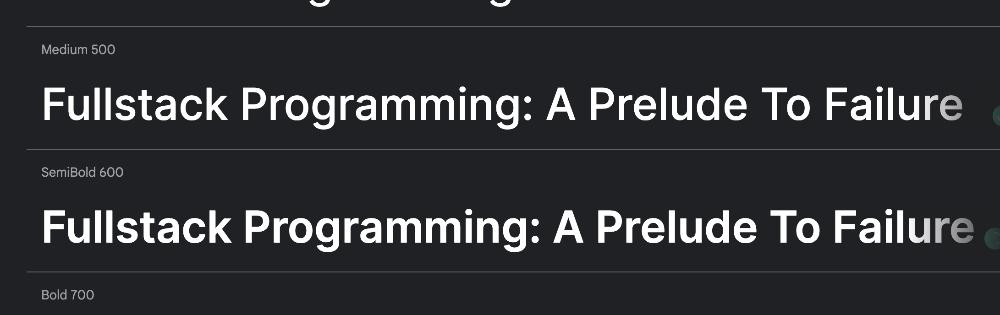
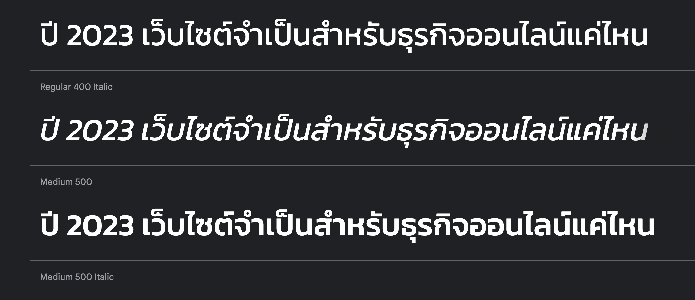
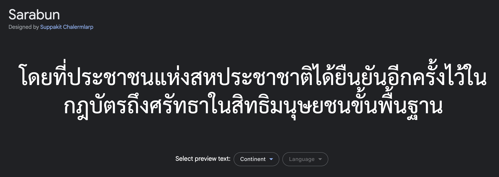

การเลือกฟอนต์เป็นเรื่องที่จะว่าง่ายก็ง่าย จะว่ายากก็ยาก จริงๆ มันก็มีหลักคิดง่ายๆ ที่เราใช้ในการเลือกฟอนต์อยู่นะ

## TL;DR

- เลือกฟอนต์สวยๆ ตาม Concept และ Style ของแบรนด์/เว็บ สำหรับส่วนหัวข้อ ชื่อเรื่อง หรือ Hero เช่น Inter, Kanit

- เลือกฟอนต์มีหัวสำหรับเนื้อหาของบทความ เช่น IBM Plex Serif, Sarabun

## มาดูตัวอย่างฟอนต์แต่ละแบบกัน

### ฟอนต์สำหรับ Headings

ตัวอย่าง font สำหรับ Headings

#### Google Inter Font

#### Google Kanit Font

จะสังเกตุเห็นว่า ทั้งสองฟอนต์ คือฟอนต์ไม่มีหัว มีความเรียบง่าย สวยงาม เหมาะกับการนำมาเป็นฟอนต์สำหรับพาดหัวหรือชื่อเรื่อง

### ฟอนต์สำหรับเนื้อหา

แต่สำหรับเนื้อหาของบทความที่มีจำนวนตัวอักษรเยอะๆ หรือมีเนื้อหาที่ค่อนข้างยาว การใช้ฟอนต์ที่ไม่มีหัว อาจจะไม่ค่อยเหมาะเท่าไหร่ เพราะอาจจะทำให้อ่านยาก และไม่สบายตา จึงควรเลือกใช้ฟอนต์มีหัวแทนครับ

#### Google Sarabun Font

แต่ทั้งนี้ทั้งนั้นก็อาจจะขึ้นอยู่กับรูปแบบของเว็บไซต์ เนื้อหาของบทความ แนวทางในการออกแบบ และกลุ่มเป้าหมายครับ

ถ้าคิดไม่ออก เลือกไม่ได้ ก็อาจจะใช้แนวทางนี้ช่วยตัดสินใจเลือกฟอนต์ได้ง่ายขึ้นครับผม
