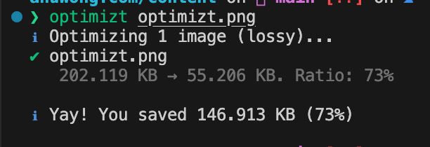

กว่า 70% ของ Bandwidth ในการใช้งานอินเตอร์เน็ต มาจากการโหลดไฟล์รูป มารู้จัก Optimizt เครื่องมือบีบอัดภาพ ที่ลดขนาดไฟล์ได้อย่างมหาศาล แต่สูญเสียรายละเอียดไปเพียงนิดเดียว

## ครึ่งนึงของ Traffic บนอินเตอร์เน็ต มาจากการโหลด Media ต่างๆ

ในการใช้งานอินเตอร์เน็ตทุกวันนี้ ส่วนมากเราจะเสพสื่อในรูปแบบของรูปภาพ และ วิดีโอ ซึ่งหลายเว็บไซต์ก็มักจะมีการแสดงผลรูปภาพในแต่ละส่วนของการทำงานแตกต่างกันไป บ้างก็ใช้เป็นภาพเพื่อการตลาด ใช้เป็น Call-to-Action หรืออาจจะใช้เพื่อแสดงสินค้าและบริการ ซึ่งกว่า 70% ของ traffic บนเว็บไซต์เหล่านี้ เกิดจากการโหลดข้อมูลรูปภาพ ดังนั้นการลดขนาดรูปภาพ จึงเท่ากับการลดปริมาณข้อมูลที่ต้องโหลด เป็นการเพิ่มความเร็วให้กับเว็บไซต์เราได้โดยตรง

[ค่าเฉลี่ยของขนาดของเว็บไซต์อยู่ที่ 2MB โดยครึ่งหนึ่งเป็นรูปภาพ](https://web.dev/learn/images/performance-issues/)

## ลดขนาดรูปภาพด้วยการบีบอัด

รูปภาพบนเว็บไซต์ส่วนใหญ่จะอยู่ในรูปแบบของไฟล์นามสกุล JPG, PNG, หรือ WEBP สำหรับเว็บยุคใหม่ อาจจะมาจากระบบ CMS ที่แอดมินอัพโหลดรูปภาพขึ้นมา แล้วหน้าเว็บก็ดึงข้อมูลที่อยู่รูปภาพจาก CDN มาแสดงผล ในหลายครั้งรูปที่ถูกอัพโหลดขึ้นมาและ serve ให้ผู้ใช้นั้นไม่ได้ทำการบีบอัดรูปภาพ หรือไม่ได้ทำการลดขนาดให้เหมาะกับอุปกรณ์มาก่อน ทำให้รูปอาจจะมีความละเอียดที่มากจนเกินไปสำหรับแสดงผลบนเว็บไซต์ หรือไฟล์ที่ใหญ่มากเกินไปสำหรับการโหลดผ่านเน็ตมือถือหรือ Slow 4G

เทคนิกในการลดขนาดรูปภาพนั้นมีหลายวิธี เช่น การทำ Progressive Image เป็นการทำรูปออกมาหลายๆ ขนาดสำหรับแต่ละอุปกรณ์ วิธีนี้ได้ผลลัพธ์ที่ดีมาก แต่ก็ต้องใช้แรงและทรัพยากรค่อนข้างเยอะ

มาดูอีกหนึ่งวิธีที่นิยมและทำได้ง่าย คือบีบอัดด้วยโปรแกรม เช่น imagemagick, sharp.js, squoosh หรือ Photoshop แต่วันนี้ผมจะแนะนำอีกหนึ่งโปรแกรมที่ใช้งานได้ง่าย สะดวกสำหรับ developer ที่ถนัดการใช้ Command Line นั่นก็คือ [Optimizt](https://github.com/funbox/optimizt) ซึ่งรองรับไฟล์ PNG, JPEG, SVG, และ GIF สามารถ compress และ export ออกมาเป็นนามสกุลเดิม หรือจะเป็นนามสกุล WEBP และ AVIF ได้เช่นกัน

## วิธีการใช้งาน Optimizt

### ติดตั้ง Optimizt

```sh
npm i -g @funboxteam/optimizt
```

### ใช้งาน Optimizt

```sh
optimizt path/to/picture.jpg
```

รายละเอียดของ CLI สามารถเข้าไปดูที่ [GitHub](https://github.com/funbox/optimizt) ของทาง Optimizt ได้เลย

### ตัวอย่างการใช้งานจริง

ก่อนที่เราจะ Deploy บทความใหม่ ถ้าบทความมีการใช้รูปภาพ เราก็จะ compress รูปนั้นก่อน เช่น

```sh
ls -l

total 408
drwxr-xr-x  11 anuwong.mon  staff     352 Aug 21 08:30 blog
-rw-r--r--   1 anuwong.mon  staff  206970 Aug 21 08:30 optimizt.png
```

ไฟล์ `optimizt.png` มีขนาด 206KB ซึ่งเราจะใช้ Optimizt ในการบีบอัดไฟล์นี้

```sh
optimizt optimizt.png

ℹ Optimizing 1 image (lossy)...
✔ optimizt.png
   202.119 KB → 55.206 KB. Ratio: 73%

ℹ Yay! You saved 146.913 KB (73%)
```

ไฟล์ `optimizt.png` ลดขนาดลงจาก 202KB เหลือเพียง 55KB ซึ่งเป็นการลดขนาดไฟล์ไปถึง 73% และเราจะได้ไฟล์ optimizt.png ที่มีขนาดเล็กลงมาใช้งานแทนไฟล์เดิมได้เลย



### ลองบีบอัดเป็น WEBP

```sh
mkdir optimized
optimizt กายแก้ว.jpeg --webp --output optimized
ℹ Converting 1 image (lossy)...
✔ กายแก้ว.jpeg
   50.372 KB → WebP 41.613 KB. Ratio: 17%

ℹ Yay! You saved 8.759 KB (17%)
```

ลองมาเปรียบเทียบระหว่าง 2 ภาพนี้ ที่เราได้จากการบีบอัดด้วย Optimizt กัน


<p style="text-align:center;">กายแก้ว.jpeg</p>


<p style="text-align:center;">กายแก้ว.webp</p>

> ภาพจาก https://www.bbc.com/thai/articles/c88v6z6wdqwo

ลองอีกครั้งกับภาพจาก Unsplash ที่มีขนาดใหญ่กว่า 1MB

```sh
ls -l
-rw-r--r--  1 anuwong.mon  staff  4143107 Aug 21 10:21 filipe-freitas-unsplash.jpg

optimizt --webp filipe-freitas-unsplash.jpg
ℹ Converting 1 image (lossy)...
✔ filipe-freitas-unsplash.jpg
   3.951 MB → WebP 2.07 MB. Ratio: 48%

ℹ Yay! You saved 1.881 MB (48%)
```


<p style="text-align:center;">filipe-freitas-unsplash.jpg (JPEG 3.951 MB)</p>


<p style="text-align:center;">filipe-freitas-unsplash.webp (WEBP 2.07 MB)</p>

> Photo by <a href="https://unsplash.com/@filipephotographs?utm_source=unsplash&utm_medium=referral&utm_content=creditCopyText">Filipe Freitas</a> on <a href="https://unsplash.com/photos/-TnJh0eRegc?utm_source=unsplash&utm_medium=referral&utm_content=creditCopyText">Unsplash</a>

## Summary

- อินเตอร์เน็ตส่วนใหญ่มีการใช้งานสื่อต่างๆ ในรูปแบบของรูปภาพ และ วิดีโอ และกว่า 50-70% ของ traffic ใช้ไปกับการโหลดรูปภาพ
- Progressive Image ช่วยให้แสดงผลรูปภาพได้เหมาะสมกับอุปกรณ์ที่ใช้งาน
- Image Optimization & Image Compression ช่วยลดขนาดไฟล์รูปภาพ และเพิ่มความเร็วให้กับเว็บไซต์ได้โดยตรง
- Optimizt เป็นเครื่องมือที่ใช้งานง่าย สำหรับ developer ที่ถนัดการใช้ Command Line โดยลดทอนรายละเอียดเพียงเล็กน้อย

เพียงใช้เครื่องมือที่เหมาะสม ก็จะช่วยให้เราทำงานได้อย่างมีประสิทธิภาพ และประหยัดเวลาได้มากขึ้น

> Use the right tool for the right job

ขอให้สนุกกับเขียนโค้ดครับ 🤓
