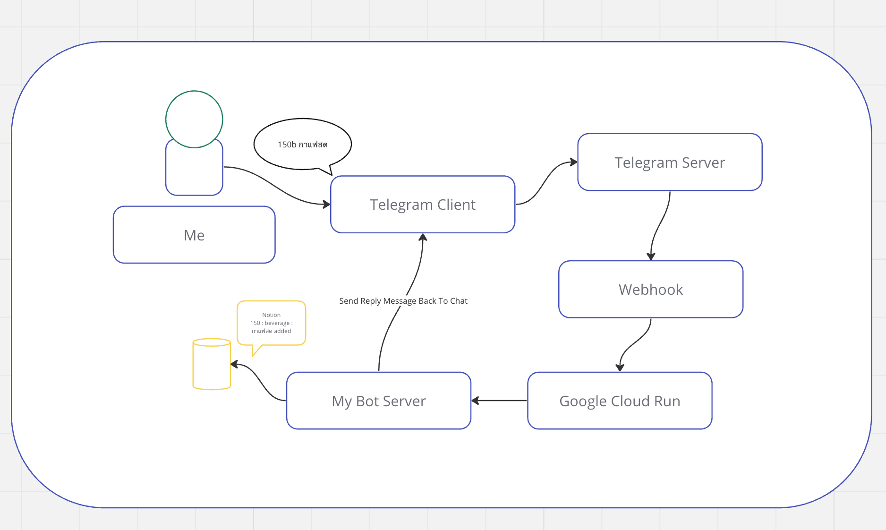
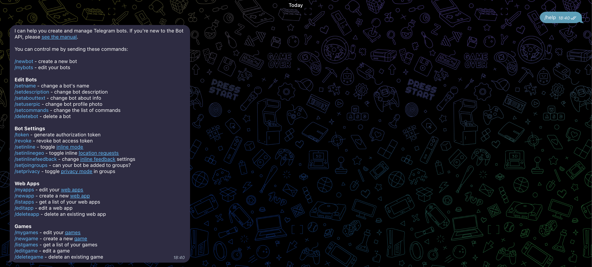
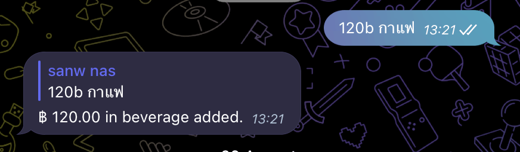
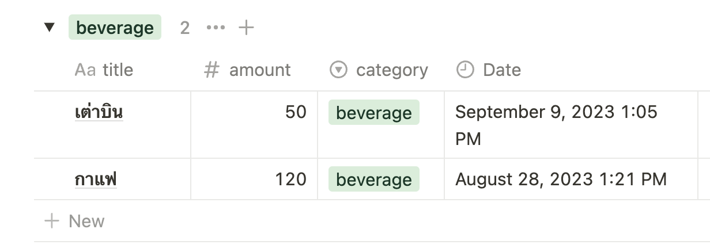

จากโพสของคุณ [janescience](https://www.janescience.com/blog/personal-tool-line) และโพสของคุณ [dtinth](https://dt.in.th/automatron.html#the-story) ที่สร้าง Personal Assistant Bot ของตัวเองขึ้นมาช่วยทำงานต่างๆ ในชีวิตประจำวัน ผมก็เลยปิ๊ง!! ไม่ใช่ปิ๊งไอเดียนะ ปิ๊ง! ลองลอกตามบ้างดีกว่า 55555 แต่ว่า ผมไม่ได้ใช้ Line ในชีวิตประจำวันเป็นหลัก ก็เลยขอปรับนิดหน่อย มาใช้ [Telegram Bot API](https://core.telegram.org/api) แทน

> สาเหตุที่ใช้ Telegram เป็นหลักเพราะมันเบาและเร็วกว่า Line มากๆ ครับ พอสามารถ convince ให้คนที่ต้องการใช้งานร่วมกันได้ ก็เลยไม่ได้ใช้ Line เลย

## Requirements

- บันทึกรายรับ-รายจ่ายผ่าน text-based command เช่น 150f ให้ลงอาหาร 150 บาท 50b กาแฟ ให้ลง ค่ากาแฟ 50 บาท พร้อมแยกหมวดหมู่ใน database
- ใช้ Notion เป็น Database เพราะใช้อยู่แล้วทุกวัน และมี API ให้ใช้งาน
- Optional รับ prompt จาก message และส่งไปหา ChatGPT แล้วส่งคำตอบกลับมา (แอบไปเห็นไอเดียของคุณ dtinth มาอีกแล้ว 5555)
- Optional แจ้งเตือนเวลาเข้า-ออกงาน ที่ทำงานผมจะมีระบบ check-in check-out สำหรับวันที่ Remote Working ฝากให้บอทช่วยสะกิดมาตอน 9:00 กับ 18:00 หน่อยละกัน

## Tech Stacks

ก่อนจะไปเรียนไปสร้าง แวะมาเลือก Tech Stack ที่จะใช้กันดีกว่า จากประสบการณ์การใช้งานบอทของ Telegram ถ้าเราใช้ channel mode ไม่น่าจะต้องทำอะไรเยอะ [แต่ว่าพอดีผมดันบังเอิญได้ไปอ่านบล็อกเกี่ยวกับ Google Cloud Run ของคุณหนูเนย](https://nuuneoi.com/blog/blog.php?read_id=973) ซึ่งอ่านแล้วว้าวมาก เพราะบอทของผมมีผมใช้คนเดียว ไม่น่าจะจำเป็นต้องรันตลอดเวลาเพื่อรับรีเควส เป็นไปได้มั้ยที่จะให้บอทมันตื่นเฉพาะตอนที่ผมส่งคำสั่งไปหามัน อาจจะมี cold start นิดหน่อยแต่ไม่เป็นไรรอได้ หลังจากนั้นก็ให้มันตื่นอยู่สักพัก ถ้าไม่มีโหลดเข้ามาก็ให้มันหลับต่อไป ประหยัด!

จากที่อ่านบล็อกของคุณหนูเนย คิดว่าเราน่าจะปรับให้ Bot เป็น Stateless โดยรับ Message มาจาก Webhook แทน จะได้ไม่ต้องรอรับ Updates ตลอดเวลา ค่อยตื่นมาทำงานตอนมี Request เข้า จากนั้นถ้าไม่มีอะไรก็หลับไป

เดี๋ยวลองดูว่าจะออกมาหน้าตาเป็นยังไง

### Programming Language

- Golang
- go-chi - Http Router
- go-telegram-bot-api - Wrapper for Telegram Bot API for Golang

### Database

- Notion and Notion API

### Services

- Telegram Bot API
- GitHub

### Infrastructure

- Docker
- Google Cloud Run



## สร้าง Bot ใน Telegram

สำหรับใครที่ใช้ Telegram อยู่แล้ว อาจจะพอผ่านตามาบ้างว่า Bot ของ Telegram มันโหดและใช้งานกันอย่างแพร่หลายมากๆ โดยในการมีบอทของตัวเอง ทำได้ง่ายๆ เพียงแค่ทักไปหา `@BotFather` ซึ่งเป็นเหมือน Interface สำหรับจัดการบอทของเราผ่าน Bot ของ Telegram อีกที

"Bot เพื่อ Bot โดย Bot"

1. แอด `@BotFather` เป็นเพื่อน และส่งข้อความหามันว่า `/help` เพื่อดูว่ามี commands อะไรให้ใช้บ้าง

   

2. สร้าง Bot ใหม่ พิม `/newbot` ไปหา `@BotFather` แล้วก็ทำตาม step ไป (ง่ายมาก) เมื่อเสร็จแล้วเราจะได้ Token ของ Bot มา จดเอาไว้ อย่าให้หายหรือให้คนอื่นรู้นะครับ

3. เมื่อเราได้บอทมาแล้ว ลองทักไปหามันดู ส่งข้อความหรืออะไรไปก็ได้ จากนั้นลองไปที่ URL นี้ `https://api.telegram.org/bot<token>/getUpdates` โดยเปลี่ยน `<token>` เป็น Token ของเรา จะเห็นว่ามันจะแสดงข้อมูลออกมาให้เราดู โดยข้อมูลที่สำคัญคือ `chat_id` ซึ่งเป็น ID ของแชทที่เราคุยกับบอท เดี๋ยวเราจะใช้ chat_id นี้แหละช่วยป้องกันผู้ไม่ประสงค์ดีแอบมาใช้บอทเรา

4. ต่อไป เราจะเริ่มสร้าง Bot กันละ โดยครั้งนี้ผมจะใช้ Golang และ package ที่ชื่อว่า [telegram-bot-api](https://github.com/go-telegram-bot-api/telegram-bot-api) เพราะ API เค้ามีครบครัน แถมใช้ง่าย ออกแบบมาดีมากๆ เหมาะกับทั้งแบบ Get Updates และแบบ Webhook เลย

> ในตัวอย่างของ go-telegram-bot-api มีตัวอย่างโค้ดของทั้งแบบ Get Updates และ Webhook ให้ดูกันแล้วเลือกใช้ตามความเหมาะสม

5. ผมใช้ `net/http` สำหรับใช้รับ http request และ `go-chi` สำหรับทำ router ครับ (พยายามใช้ built-in `net/http` ครับ จะได้ลด docs ที่ต้องอ่าน)

> Source Code แบบเต็มๆสามารถเข้าไปดูได้ที่ [GitHub](https://github.com/anwam/jaravisa-tg-bot)

```go
package main

func main() {
  // new envs
  // new service
  // ...

  r := chi.NewRouter()
	r.Get("/", func(w http.ResponseWriter, r *http.Request) {
		w.Header().Set("Content-Type", "application/json")
		w.WriteHeader(http.StatusOK)
		json.NewEncoder(w).Encode(map[string]string{"status": "ok"})
	})

	r.Post("/webhooks", func(w http.ResponseWriter, r *http.Request) {
		tgUpdate := new(tgbotapi.Update)
		if err := json.NewDecoder(r.Body).Decode(tgUpdate); err != nil {
			w.WriteHeader(http.StatusBadRequest)
			json.NewEncoder(w).Encode(map[string]string{"error": err.Error()})
			return
		}
		if tgUpdate != nil && tgUpdate.Message != nil {
			service.HandleWebhook(tgUpdate) // ส่ง Update ไปให้ service ทำงานต่อ
		}
		w.Header().Set("Content-Type", "application/json")
		w.WriteHeader(http.StatusOK)
		json.NewEncoder(w).Encode(map[string]string{"status": "ok"})
	})
	http.ListenAndServe(":"+envs.Port, r)
}
```

6. ต่อไปจะเป็นส่วนของ service หลักที่จะจัดการตรวจ Message ที่ได้มาจาก Webhook ว่าตรงกับ pattern ที่เรากำหนดไว้หรือเปล่า ถ้าถูกจะส่งไปหา Notion แล้ว reply ตอบ command นั้นว่า โอเครายการนี้เพิ่มให้ละ

   

```go
package service

type Service struct {
  // whatever
}

func (s *Service) HandleWebhook(update *tgbotapi.Update) error {
  if update.Message == nil { // ignore non-Message updates
    return nil
  }

  if update.Message != nil { // If we got a message
    amount, category, title := s.extract(update.Message.Text) // Go สามารถ return ได้หลายค่า ขี้เกียจออกแบบ struct เอาแบบลูกทุ่งๆ ไปก่อน
    if amount != 0 && category != "" {
      err := s.notion.Add(amount, category, title) // ส่งไปให้ Notion Client เอาไปเก็บลง Database
      if err != nil {
        msg := tgbotapi.NewMessage(update.Message.Chat.ID, "Something happens with Notion. Check system log in Cloud Run Logs.")
        msg.ReplyToMessageID = update.Message.MessageID
        s.tgBot.Send(msg)
        return nil
      }

      messageText := fmt.Sprintf("฿ %.2f in %s added.", amount, category)
      msg := tgbotapi.NewMessage(update.Message.Chat.ID, messageText)
      msg.ReplyToMessageID = update.Message.MessageID
      s.tgBot.Send(msg)
      return nil
    }
    msg := tgbotapi.NewMessage(update.Message.Chat.ID, "I don't understand this command")
    msg.ReplyToMessageID = update.Message.MessageID
    s.tgBot.Send(msg)
  }
  return nil
}
```

7.  จากนั้นมาเขียน Notion Client ให้ไปติดต่อกับ Notion API เพื่อส่งข้อมูลไปเก็บใน Database ของเรา

    

```go
package notion
type Notion struct {
	// whatever
}

func (n *Notion) Add(amount float64, category, title string) error {
	props := map[string]interface{}{
		"amount":   NewAmountProperty(amount),
		"category": NewCategoryProperty(category),
	}

	if title != "" {
		props["title"] = NewTitleProperty(title)
	} else {
		props["title"] = NewTitleProperty(fmt.Sprintf("฿ %.2f spend with %s", amount, category))
	}
	payload := NotionPostPayload{
		Parent: Parent{
			Type:       "database_id",
			DatabaseID: n.DatabaseID,
		},
		Properties: props,
	}
	payloadBytes, _ := json.Marshal(payload)
	payloadReader := bytes.NewReader(payloadBytes)

	req, _ := http.NewRequest("POST", "https://api.notion.com/v1/pages", payloadReader)
	req.Header = http.Header{
		"Authorization":  []string{"Bearer " + n.Token},
		"Content-Type":   []string{"application/json"},
		"Notion-Version": []string{"2022-06-28"},
	}
	resp, err := n.http.Do(req)
	if err != nil {
		return err
	}

	defer resp.Body.Close()

	if resp.StatusCode >= http.StatusBadRequest {
		responseError := make(map[string]interface{})
		json.NewDecoder(resp.Body).Decode(&responseError)
		return fmt.Errorf("request failed with status code %d", resp.StatusCode)
	}

	respBody := make(map[string]interface{})
	json.NewDecoder(resp.Body).Decode(&respBody)
	return nil
}
```

8.  ต่อไปเราจะต้องสร้าง Docker Image ขึ้นมาเพื่อใช้ในการ Deploy บน Cloud Run แล้วเราก็จะสร้าง Dockerfile ขึ้นมา

```Dockerfile
FROM golang:1.21-alpine AS builder

WORKDIR /app

COPY go.mod go.sum ./

RUN go mod download

COPY . .

RUN go build -o main ./cmd/...

FROM debian:buster-slim AS runner

COPY --from=builder /app/main /app/main

# manage your secret

CMD ["/app/main"]
```

9. ตอนนี้เราจะ Push Code ขึ้นไปไว้บน GitHub ไปรอก่อนเลย จากนั้นไปสมัคร GCP และเข้าไปที่ Cloud Run Dashboard เพื่อเชื่อม GitHub กับ GCP และให้ตัว Cloud Run และ Cloud Build Trigger เมื่อเรามีการ Push Code ขึ้นไปที่ GitHub จะได้ทำการ Build และ Deploy ให้อัตโนมัติ

   อย่าลืมคิดวิธีจัดการ Secret ด้วยล่ะ ส่วนของผมไม่บอกละกัน กลัวอธิบายผิด 5555

   เสร็จแล้ว ลองแก้โค้ดดูแล้ว Push ขึ้นไปใหม่ Service จะพยายามรันละ แต่บางคนอาจจะเจอ error ว่า bot มันไม่สามารถรับ webhook ได้ เพราะเรายังไม่ได้ไป setWebhook กับทาง Telegram เนอะ ตามไปอ่านที่นี่เลย [Telegram setWebhook](https://core.telegram.org/bots/api#setwebhook) ถ้าเสร็จแล้ว ตอนนี้ Bot เราจะสามารถรับ webhook ได้แล้ว ผ่าน API ของ Cloud Run ที่เราเอาไป setWebhook กับทาง Telegram นั่นแหละ

10. optional features เหมือนจะทำไม่ทัน 5555 เดี๋ยวไว้เรามาอัพเดทกันใหม่ถ้ามีเวลาทำมากพอละกัน

## สรุป

- สร้าง Bot ใน Telegram ได้ง่ายมากๆ แค่ทักไปหา `@BotFather` แล้วตามขั้นตอนที่มันบอกไปเลย
- Telegram Bot แบบ Webhook เหมาะกับการใช้งานคู่กับ Google Cloud Run มากๆ ลดค่าใช้จ่ายไปได้เยอะเลย
- Notion API ช่วยให้เราสามารถเขียนระบบหรือ Automation ช่วยงานในชีวิตประจำวันได้ดีมาก เพราะผมชอบ UI ของ Notion ที่สุดละเท่าที่เคยใช้มาหลายๆ ตัว
- การเลือกใช้ Techonology ให้เหมาะสมกับงานถือเป็นสิ่งที่ฝึกฝนกันได้ ถ้าเรารู้จักเครื่องมือหรือเทคโนโลยีมากพอ เราก็จะเลือกใช้มันได้อย่างเหมาะสม ลดภาระค่าใช้จ่ายได้เยอะเลย

ขอให้สนุกกับการเขียนโค้ดครับ

## Source Code

- [jaravisa-tg-bot - GitHub](https://github.com/anwam/jaravisa-tg-bot)

## References

- [เมื่ออยากมี Tools ส่วนตัวใช้ในชีวิตประจำวันผ่าน LINE - www.janescience.com](https://www.janescience.com/blog/personal-tool-line)
- [automatron - dt.in.th](https://dt.in.th/automatron.html)
- [บันทึกการย้ายโปรดักชั่นเข้า Google Cloud Run กับค่าใช้จ่ายที่ลดลงหลัก 100 เท่า - nuuneoi.com](https://nuuneoi.com/blog/blog.php?read_id=973)
- [Telegram Bot API](https://core.telegram.org/bots/api)
- [telegram-bot-api - Telegram Bot API for Golang](https://github.com/go-telegram-bot-api/telegram-bot-api)
- [Notion API](https://developers.notion.com/)
- [Google Cloud Run](https://cloud.google.com/run)
- [Google Cloud Build](https://cloud.google.com/build)
