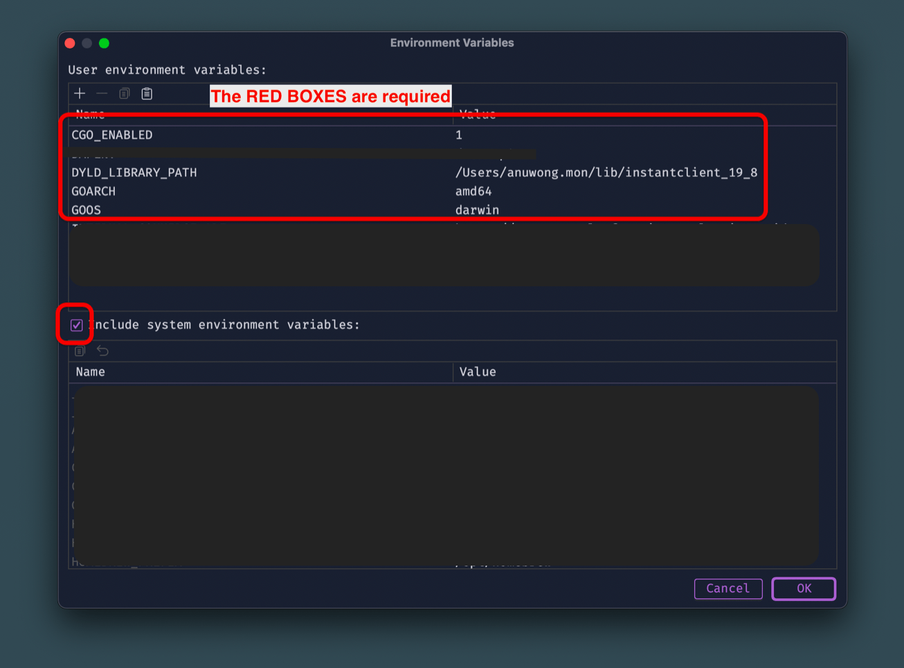

ที่ทำงานเจอปัญหาว่าระหว่างพัฒนา Golang Application ไม่สามารถเชื่อมต่อกับ Oracle DB ได้ เป็นเพราะว่า Oracle Client ยังไม่รองรับสถาปัตยกรรม ARM64 ของ Apple Silicon นั่นเองครับ วันนี้จะพามาเซ็ตอัพ Configuration ต่างๆ กัน

## Prerequisite

- [Oracle Instant Client for MacOS](https://odpi-c.readthedocs.io/en/latest/user_guide/installation.html#oracle-instant-client-dmg-files)
- Any IDE (VSCode, Goland, etc.)

## Steps

1. [ดาวน์โหลด Oracle Instant Client for MacOS](https://odpi-c.readthedocs.io/en/latest/user_guide/installation.html#oracle-instant-client-dmg-files)

   จะติดตั้งด้วยวิธีไหนก็ได้ (แนะนำให้ใช้ zip file)

2. เตรียมไฟล์ให้พร้อม

   แตกไฟล์ zip จะได้ folder ชื่อว่า `instantclient_19_8` มา แล้วเอา folder นี้ไปวางไว้ที่ที่ไปถึงได้ง่ายๆ เช่น `~/libs` จะได้ path ของ oracle lib ว่า `~/libs/instantclient_19_8`

3. Shell Configuration

   ไปทำการแก้ไข shell config ตามที่ใช้ เช่น `~/.zshrc` สำหรับคนใช้ zsh หรือ `~/.bashrc` สำหรับคนใช้ bash ด้วย config ดังนี้

   ```sh
   export DYLD_LIBRARY_PATH="~/libs/instantclient_19_8"
   export LD_LIBRARY_PATH="~/libs/instantclient_19_8"
   ```

> ถ้าเอา lib ไปไว้ที่ path ตามผม ก็ไม่ต้องแก้อะไร ถ้าเอาไปไว้ที่อื่นก็ปรับตามด้วยครับ

4. Golang ENV Configuration
   ดูเหมือนว่า Oracle Instant Client จะยังไม่ support สถาปัตยกรรม ARM64 ดังนั้นทุกครั้งเวลาเราจะรัน `go run .` หรือ `go build` ให้ใส่ env ตามนี้

   ```sh
   CGO_ENABLED=1 GOOS=darwin GOARCH=amd64 go build
   ```

   หรือเพิ่ม DYLD_LIBRARY_PATH ไปในขั้นตอนการรันด้วยก็ได้ครับ เช่น

   ```sh
   CGO_ENABLED=1 GOOS=darwin GOARCH=amd64 DYLD_LIBRARY_PATH=~/libs/instantclient_19_8 go build
   ```

   > ถ้าใครใช้ Goland ก็สามารถเพิ่ม env ได้ใน Run Configuration ดังนี้
   > 
   > เรียบร้อย

5. Restart Shell or IDE everytime things changed

   ทุกครั้งที่มีแก้ไข shell config หรือ IDE Run Config อย่าลืม Restart ทุกครั้งนะครับ เผื่อว่า config ที่เราแก้ไปมันยังไม่ได้ถูก apply ให้กับ shell หรือ IDE ที่เราใช้

เพียงเท่านี้เราก็จะสามารถทำงานกับ Oracle บนเครื่อง Mac ที่ใช้ Chip Apple Silicon ได้แล้วครับ
