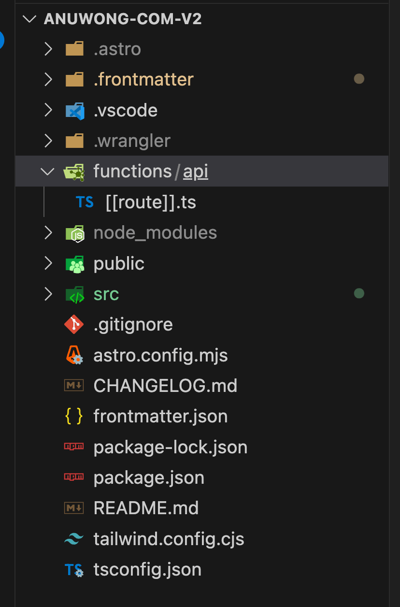

วันนี้มาแนะนำ Web Framework สำหรับ Edge Computing ที่ชื่อ [Honojs](https://hono.dev/) โดยจะนำมาใช้กับ Cloudflare Pages Functions ครับ

[เอกสารแนะนำการใช้งาน Honojs กับ Cloudflare Pages Functions](https://hono.dev/getting-started/cloudflare-pages)

## Cloudflare Pages Functions

อันดับแรกเรามาทำความรู้จักกับ Cloudflare Pages Functions กันก่อน Cloudflare Pages เป็นบริการ Static Site Hosting ที่ทาง Cloudflare เปิดให้ใช้งานได้ฟรี โดยจะมี Feature การสร้าง Serverless REST APIs ที่เรียกว่า Functions ที่สามารถเรียกใช้งานได้โดยตรงผ่าน Static Site ที่ Host ด้วย Cloudflare Pages ได้เลย

เจ้า Functions เนี่ยจริงๆ แล้วมันคือ Cloudflare Workers หรือก็คือเป็น Serverless Function ที่ Cloudflare นำมา Integrate เข้ากับ Pages นั่นแหละ เพื่อให้ใช้งานได้ง่ายและบริหารจัดการได้ภายใน Cloudflare Pages ได้โดยตรง

ความสามารถของ Cloudflare Pages Functions จะเหมือนกับที่ Cloudflare Workers ทำงานได้เลย ทั้งการรับ Request, Response ทั้งการทำงานกับ KV, D1, R2 หรือ Durable Object โดยจะตั้งค่าผ่าน Bindings ผ่านหน้า Dashboard ของ Cloudflare Pages ได้ง่ายมากๆ

## Honojs - Web Framework สำหรับ Edge Computing

มาถึงพระเอกของวันนี้บ้าง Honojs เป็น Web Framework ที่มีการพัฒนาโดยเน้นที่การรันบน Edge Computing เช่น AWS Lambda, Cloudflare Workers, Deno, Bun, Netlify และ Nodejs จุดเด่นของ Honojs คือขนาดที่เล็กมาก และความเร็วในการทำงาน ประสบการณ์สำหรับนักพัฒนา และ battery-included features ต่างๆ ที่ใส่มาให้อย่างครบครัน

ตัวอย่างโค้ดเริ่มต้นของ Honojs ในการทำ REST APIs

```js
import { Hono } from "hono";

const app = new Hono();

app.get("/", (c) => {
  return c.text("Hello Hono!");
});

export default app;
```

## การใช้งาน Honojs กับ Cloudflare Pages Functions

ในบทความนี้เราจะขอข้ามขั้นตอนการ Initial Project ไปเพราะในเอกสารของ Honojs และ Cloudflare Pages เขียนไว้ดีมากๆ แล้ว

มาเริ่มที่การใส่ functions เข้าไปใน existing project เลย โดยโปรเจคที่ผมใช้วันนี้ก็คือเว็บบล็อกนี้นี่แหละ เป็น Astro App ที่ Host อยู่บน Cloudflare Pages อยู่แล้ว ซึ่ง APIs ที่ผมอยากเพิ่มก็คือ APIs สำหรับการเก็บจำนวน Page Views ของแต่ละหน้า โดยจะเก็บข้อมูลลงไปที่ KV ของ Cloudflare Workers

### 1. สร้าง folder functions/api

สำหรับโปรเจคที่ใช้ Cloudflare Pages CI สามารถเพิ่ม directory `functions` ที่ root ได้เลย ซึ่ง Cloudflare Pages CI มันจะรู้เองว่า Pages นี้ต้องการสร้าง Functions ขึ้นมาด้วย มันจะจัดการ Build, Config, และ Deploy ให้อัตโนมัติ



### 2. สร้างไฟล์ functions/api/[[route]].js

เป็นไฟล์ที่จะเป็น entrypoint ของ /api ทั้งหมด แล้วเราจะ handle endpoints ต่างๆ ด้วย honojs นั่นเอง

ในไฟล์นี้จะมีการกำหนด Base Path ของ API ผมจะใช้ชื่อว่า /api ละกัน และจะมีการกำหนดการ Bindings กับ Services ต่างๆ ที่เราจะใช้ เช่น KV, R2 ในกรณีนี้ผมใช้แค่ KV เพียงอย่างเดียว

```js
import type { KVNamespace } from "@cloudflare/workers-types";
import { Hono } from "hono";
import { handle } from "hono/cloudflare-pages";

type Bindings = {
  PAGE_VIEW: KVNamespace;
};

const app = new Hono<{ Bindings: Bindings }>().basePath("/api");

app.get("/counter/:slug", async (c) => {
  const { slug } = c.req.param();
  const count = await c.env.PAGE_VIEW.get(slug);

  if (count === null) {
    await c.env.PAGE_VIEW.put(slug, "1");
    return c.json({
      slug: slug,
      count: 1,
    });
  }

  return c.json({
    slug: slug,
    count: count || 0,
  });
});

app.put("/counter/:slug", async (c) => {
  const { slug } = c.req.param();
  const count = await c.env.PAGE_VIEW.get(slug);
  if (count) {
    await c.env.PAGE_VIEW.put(slug, (Number(count) + 1).toString());
  } else {
    await c.env.PAGE_VIEW.put(slug, "1");
  }

  return c.json({
    slug: slug,
    count: Number(count) + 1 || 1,
  });
});

export const onRequest = handle(app);
```

เสร็จแล้ว เพียงเท่านี้ app ของเราที่รันอยู่บน Cloudflare Pages ก็จะสามารถเรียก API เหล่านี้ผ่าน /api ได้ทันที เราทำได้เพียงแค่ deploy ขึ้นไปเดี๋ยว Cloudflare Pages CI มันจะจัดการให้เอง

### 3. ทดสอบบน Local

ก่อนจะ Deploy เรามาลอง Functional Test ดูก่อนว่า ตัว Functions ที่เราสร้างขึ้นมามันทำงานได้ถูกต้องหรือไม่

เราต้องใช้ wrangler ที่เป็น CLI ของ Cloudflare ในการรัน app เพื่อทดสอบบน Local ก่อน ก็ติดตั้ง wrangler ไว้ที่ devDependencies ของ package.json ก่อน

```sh
npm i -D @cloudflare/workers-types wrangler
```

จากนั้น แก้ `package.json` โดยเพิ่ม scripts ใหม่สำหรับรันผ่าน wrangler

```json
"scripts": {
    "dev:pages": "wrangler pages dev --kv=PAGE_VIEW --compatibility-date=2023-09-04 --port 4322 --proxy 4321 -- bunx astro dev",
},
```

สิ่งที่สำคัญคือ `--kv=PAGE_VIEW` โดยเราจะต้องกำหนด value ให้ตรงกับที่เรา config เอาไว้ที่ bindings บน dashboard ของ cloudflare และตรงกับที่เรากำหนดไว้ที่ honojs app ด้วยนะ

อีกส่วนที่สำคัญในการใช้ wrangler รัน app ที่มี build tools ของตัวเองก็คือ `--proxy {PORT} -- bunx astro dev` ตรงนี้หมายถึงให้ wrangler มันทำการ proxy ไปหา process ที่เราจะใช้รัน app ของเรา โดย app หลักเราจะรันที่ port 4321 และ wrangler จะ proxy 4322 ไปหาให้ พร้อมกับความสามารถของ functions และ kv ที่ใช้งานได้เลย

เสร็จแล้ว 🎉

## สรุป

การนำ Honojs มาใช้งานกับ Cloudflare Pages Functions ไม่มีอะไรยากเลย เพียงแค่เราเข้าใจการ Config ของ framework ที่เราใช้งานอยู่ เลือกเครื่องมือให้เหมาะสม ก็จะช่วยให้เราทำงานได้ง่าย ลดเวลาในการพัฒนา และเพิ่มประสบการณ์ในการทำงานให้กับนักพัฒนาเองด้วย

Happy Coding ครับผม
