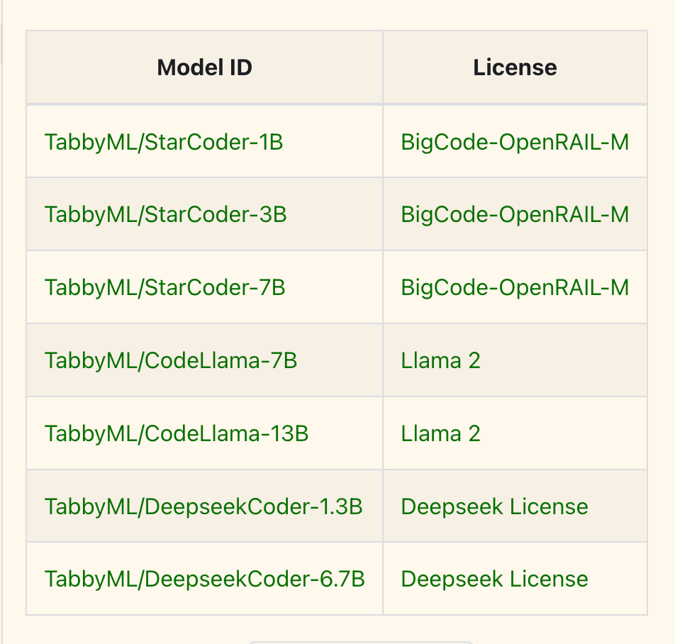
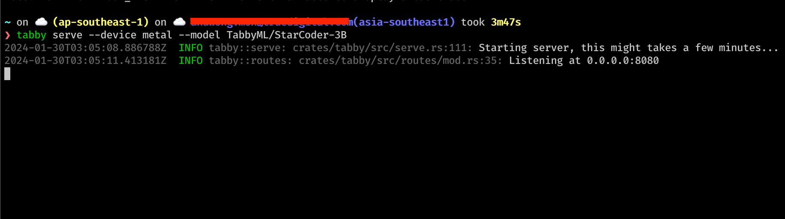
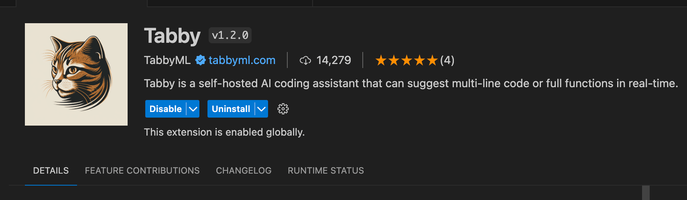
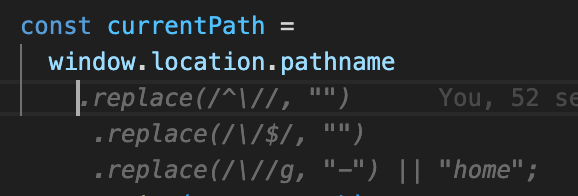
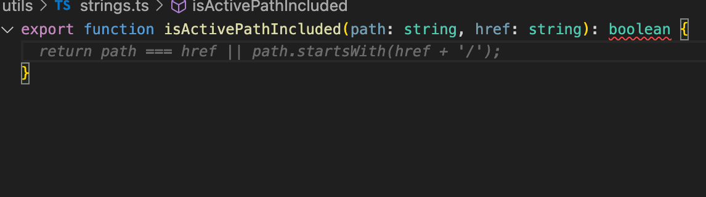

ทุกวันนี้ AI เข้ามามีบทบาทในการทำงานแทบจะในทุกมิติ ไม่เว้นแม้แต่งาน Programming มีหลายคนได้ลองใช้ Coding Assistant กันมาบ้าง วันนี้เราพามาดู Coding Assistant ที่สามารถรันบนเครื่องเราเพื่อประหยัดเงินและยังปลอดภัยอีกด้วย

> Tabby
> Opensource, self-hosted AI coding assistant
>
> https://tabby.tabbyml.com/

หลายคนที่ใช้ GitHub Co-Pilot ในการช่วยงานต่างๆ เช่น Generate Test Case จาก Function ที่เราเขียนเสร็จแล้ว หรือใช้เป็นที่ปรึกษาในการตรวจสอบ Edge cases ของการทำงานของโปรแกรม นอกจากนี้ยังมีความสามารถในการ Generate Completion ระหว่างการเขียน function ได้โดยอิงจาก Pattern หรือ Style ในการเขียนโค้ดของเราอีกด้วย

## TabbyML Opensource, self-hosted AI coding assistant

หลังจากจ่ายเงินค่า GitHub Co-Pilot ไปหลายเดือน หลังๆ มาก็รู้สึกเป็นห่วงเรื่องของความปลอดภัย เช่น ไม่รู้ว่าตัว Extension มันจะเข้ามาอ่าน secrets ที่อยู่บน local branch ของเราไหม หรือว่าตัว business ของบริษัทเนี่ยมันจะปลอดภัยจริงๆ หรือเปล่า และเรื่องของค่าใช้จ่ายที่ค่อนข้างสูง ก็เลยตัดสินใจเลิกใช้ GitHub Copilot ไป

ล่าสุดไปเจอ Extension ที่ชื่อ TabbyML โดยจะทำงานคล้ายๆ กับ GitHub Copilot เลย เพียงแต่เราต้องรันตัว LLM Server เอง จะรันบน Local หรือจะเอาไป Host บน VPS ของเราเองก็ได้ โดย TabbyML ก็จะมี Language Models หลายขนาดให้เลือกใช้ตามกำลังของเครื่อง ตั้งแต่ 1B จนถึง 13B เลยทีเดียว เครื่องใครไหวเท่าไหนก็ลองดูครับ



## Installation โคตรง่าย

```sh
brew install tabbyml/tabby/tabby

# Start server with StarCoder-1B
tabby serve --device metal --model TabbyML/StarCoder-1B
```

เพียงเท่านี้เราก็จะได้ LLM server รันอยู่บนเครื่องแล้ว

## ข้อดีของ TabbyML

ด้วยความที่เป็น Self-Hosted ข้อดีอย่างแรกเลยคือฟรี (ถ้ารันบน localhost) ไม่ต้องเสียเงินรายเดือนแพงๆ จ่ายให้ GitHub อีกต่อไป อีกข้อที่เรากังวลก็คือเรื่องของความปลอดภัย คือตัว Language model มันรันอยู่บนเครื่องเรา แล้ว extension ใน editor มันก็ชี้ไปที่ localhost เราเอง ดังนั้นข้อมูลต่างๆ มันก็ไม่น่าจะหลุดออกไปที่ไหน คิดว่าปลอดภัยพอสมควร ทำให้มั่นใจในการจะใช้ Coding Assistant กับงานต้อง concern เรื่อง privacy หรือตวามลับทางการค้าต่างๆ



ส่วนการใช้งานก็แสนง่าย แค่โหลด Extension ชื่อ Tabby ใน VSCode และก็ใส่ `http://0.0.0.0:8080` ใน Settings ก็เป็นอันเสร็จเรียบร้อย



เพียงเท่านี้ `Tabby` ก็จะคอย generate suggestions ให้เราเหมือนกับเป็นผู้ช่วยในการออกไอเดียหรือเดาการทำงานของเราได้เลย ถือว่าน่าพอใจสำหรับการใช้งานเล็กๆ น้อยๆ ครับผม





## ข้อเสียของ TabbyML

ด้วยการที่ต้องรัน LLM Server บนเครื่องตัวเอง ทำให้ใครทีคอมไม่ได้แรงมาก ก็จะติดข้อกำจัดก็อยู่ที่ขนาดของ Language Model ที่เราเลือกใช้นะฮะ คอมใครแรงไม่พอ อาจจะต้องใช้ model ขนาดเล็กหน่อย ความสามารถมันก็อาจจะสู้ GitHub Copilot ไม่ได้ และก็จะเสีย Resources บางส่วนในการแบ่งไปรัน LLM Server เพื่อให้ Extension ทำการรับส่งข้อมูลนั่นเอง

ส่วนถ้าจะลงทุนเช่า VPS เพื่อใช้รัน LLM Server ก็อาจจะต้องหาเครื่องที่เหมาะกับการใช้งานเรา ก็จะเสียข้อดีเรื่องของค่าใช้จ่าย แต่ก็จะมั่นใจในเรื่องของความปลอดภัยและความเป็นส่วนตัวได้ดีฮะ สำหรับใครที่ค่อนข้าง Concern เรื่องนี้

ถือว่าเป็นอีกหนึ่งทางเลือกในการใช้งาน Coding Assistant นะครับ สำหรับคนที่งบน้อยแต่คอมแรง พอรันไหว ก็สบายไปเลย ขอให้มีความสุขกับการเขียนโค้ดคร้าบ
