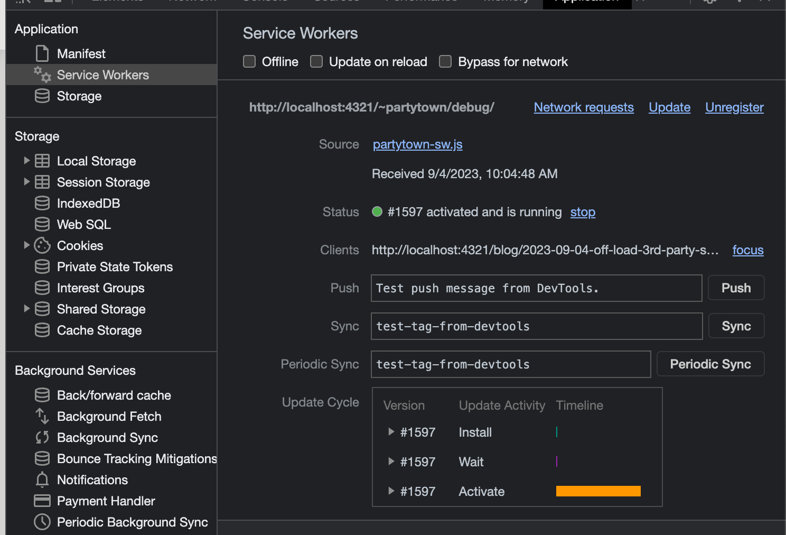
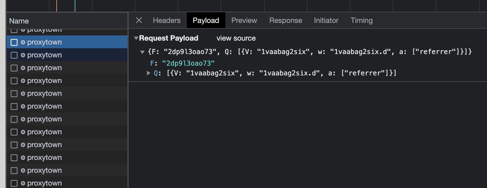
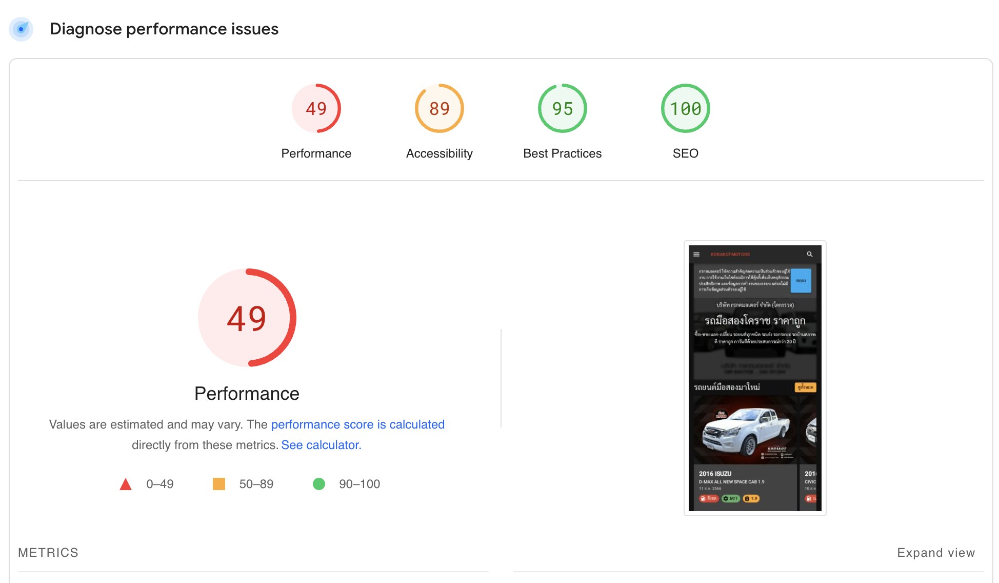
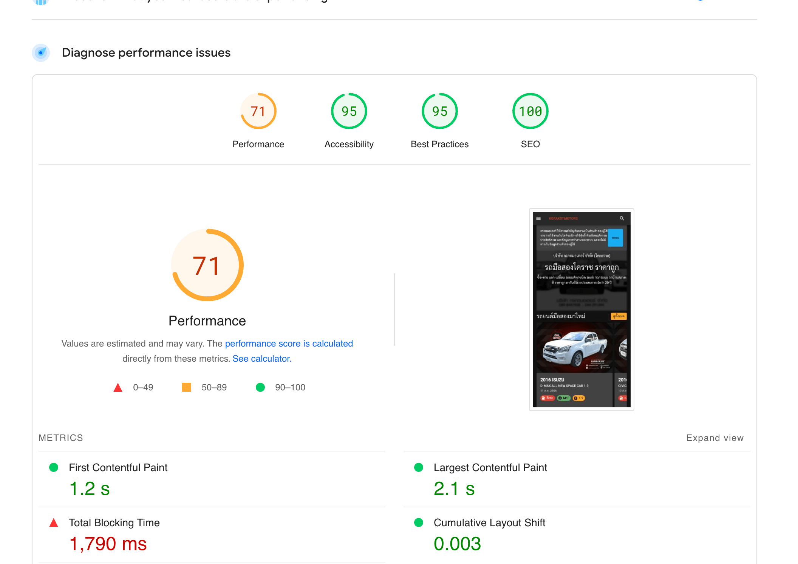

analytics tools ต่างๆ ที่เราใช้เพื่อ track user เป็นตัวที่ block main thread ทำให้เว็บของเราช้าลง เราจะย้าย 3rd-party script ไปรันบน web worker ด้วย partytown

## partytown ทำงานยังไง

[อ่านเอกสารของ partytown ได้เลย](https://partytown.builder.io/how-does-partytown-work)

โดยสรุปแล้ว partytown จะเป็นตัวช่วยให้การสื่อสารระหว่าง main thread และ web worker นั้นเป็น synchronous และทำได้ง่ายโดยที่เราไม่ต้องไปจัดการที่ communication layer ระหว่าง main thread, web workers, service workers และ 3rd-party scripts ที่เราต้องการให้ทำงานบน web worker

ข้อดีในการเอา partytown มาใช้คือ การทำงานหนักๆ ของ 3rd-party libraries ที่เรามาใช้ จะถูกส่งไปใช้ web workers ทำงานแทน ลดภาระการทำงานของ main thread ซึ่งผลลัพธ์ก็คือ main thread จะเหลือเวลาไป execute script หลักของเว็บเยอะขึ้น ทำให้เว็บเรารันได้เร็วขึ้น

## ติดตั้ง partytown

สำหรับการใช้งานของผม ใช้ควบคู่กับ `Astro` ซึ่งมี integration ช่วยทำให้ใช้ได้ง่ายขึ้น

> [อ่านเพิ่มเติมที่ Astro docs](https://docs.astro.build/en/guides/integrations-guide/partytown/)

```sh
npx astro add partytown
```

จะมี prompt ต่างๆ ให้ตอบ `yes` ไปแล้ว `astro.config.js` ของเราจะหน้าตาคล้ายๆ แบบนี้

```js
import { defineConfig } from "astro/config";
import partytown from "@astrojs/partytown";

export default defineConfig({
  // ...
  integrations: [partytown()],
});
```

หลังจากนั้นเพื่อให้สามารถให้ partytown จับ event ของ `Google Tag Manager` ได้ ให้เพิ่ม config ไปตามนี้

```js
import { defineConfig } from "astro/config";
import partytown from "@astrojs/partytown";

export default defineConfig({
  // ...
  integrations: [
    partytown({
      config: {
        forward: ["dataLayer.push"],
      },
    }),
  ],
});
```

> [ดูการ config สำหรับ services ต่างๆ เพิ่มเติม](https://partytown.builder.io/common-services)



<p style="text-align:center;">เมื่อดู Console > Applications > Service Workers จะเห็น partytown-sw.js registered อยู่</p>

ทีนี้ เราก็เอา script ของ `Google Tag Manager` ไปแปะใน layouts หรือ header ของเราได้เลย โดยให้เพิ่ม attribute ที่ชื่อ `type="text/partytown` ไปด้วย

```html
<!-- Google Tag Manager -->
<script
  type="text/partytown"
  src="https://www.googletagmanager.com/gtag/js?id={YOUR-GTAG-ID}"
></script>
<script type="text/partytown">
  window.dataLayer = window.dataLayer || [];
  function gtag() {
    dataLayer.push(arguments);
  }
  gtag("js", new Date());
  gtag("config", "{YOUR-GTAG-ID}");
</script>
```

เรียบร้อย! 🎉 เท่านี้เราก็จะได้ `Google Tag Manager` ที่รันอยู่บน web worker แล้ว โดยดูได้จาก network ที่มีชื่อว่า `proxytown` type เป็น `xhr` และ size จะมีคำว่า `ServiceWorker` อยู่ หากเรากดดู payload จะเห็นว่าเป็น event ที่จะส่งไปให้ `Google Tag Manager` ทำการ track ข้อมูลต่างๆ ของเรา



<p style="text-align:center;">ใน Console > Network จะเห็น proxytown ที่ type เป็น xhr เพียบเลย เกิดจาก partytown ไปจับ event ตามที่เรา config แล้วส่งไปให้ web worker ทำงานให้แทน</p>

## ใช้งานจริงกับเว็บที่มีอยู่แล้ว

ผมมี **NextJS Application** อยู่หนึ่งตัวที่เอาไว้โชว์หน้าร้านของธุรกิจที่บ้าน มีปัญหาคือต้องใช้ **_Google Analytics_**, **_Facebook Customer Chat_**, และ **_Google Map Widget_** ทำให้หน้าแรกนั้นใช้เวลาโหลดนานมาก เจ้า **Lighthouse** ก็แจ้งเตือนว่า ให้ลดงานที่ main thread ต้องทำลงหน่อย ก็เลยจัดการตามนี้

- เปลี่ยน Facebook Customer Chat จาก instructions script ที่ได้จาก Facebook มาใช้ [react-live-chat-loader](https://github.com/calibreapp/react-live-chat-loader) เพื่อให้ load facebook sdk script หลังจากคลิกเปิด chat แล้ว

- ใช้ **experimental feature** ของ NextJS ที่ชื่อ `nextScriptWorkers` โดย feature นี้เราจะสามารถใช้ Script strategy="worker" ได้ โดยเบื้องหลังก็คือการใช้ `partytown` ในการทำงานให้นั่นเอง โดย library ที่ผมใช้วิธีนี้ก็คือ `Google Tag Manager` นั่นเอง ให้ web worker ไปโหลด script มาให้ จากนั้นก็ config ให้ forward event `dataLayer.push` และ `gtag` ส่งไปให้ web worker ทำงานแทน เท่านี้ main thread ก็จะว่างไปทำงานอย่างอื่นแทนละ

มาดูผลลัพธ์กัน

### ก่อน



คะแนน Performance แค่ 49 เพราะเสียเวลาไปกับการ load และ execute ทั้ง `Google Tag Manager` และ `Facebook SDK`

### หลัง



พอ main thread ว่างจากการที่ไม่ต้องไปทำงานเกี่ยวกับ `GTM` แล้ว ก็มีเวลามารัน react evaluation เหลือๆ ได้คะแนนเพิ่มมาเป็น 71 แล้ว 🎉 ถือว่าทำน้อยได้มากที่แท้จริง

## สรุป

- การใช้ partytown จะช่วยให้เราสามารถย้าย 3rd-party script ไปรันบน web worker ได้ง่ายขึ้น
- การทำงานหนักๆ ของ 3rd-party libraries ที่เรามาใช้ จะถูกส่งไปใช้ web workers ทำงานแทน ลดภาระงานของ main thread ทำให้เหลือ resource มาทำงานอย่างอื่นเพิ่มขึ้น
- Astro มี integration ช่วยให้ setup และ config ได้ง่ายขึ้นมากๆ
- NextJS มี exterimental feature ที่รองรับการใช้งาน partytown ได้เลย ผ่าน `next/script` attribute `strategy="worker"`

## อ่านเพิ่มเติม

[Trade-Offs](https://partytown.builder.io/trade-offs) ข้อดี-ข้อเสีย และข้อจำกัดของ partytown ในการเลือกใช้กับ 3rd-party script ประเภทต่างๆ

[Integration Guides](https://partytown.builder.io/integrations) คู่มือการ setup สำหรับ framework ต่างๆ เช่น Astro, Nextjs, Html, Vue, Nuxtjs

[Forwarding Events](https://partytown.builder.io/forwarding-events) หลักการทำงานของ partytown ที่ทำการ forward event ไปให้ web worker ทำงานแทน

ข้อให้มีความสุขกับการเขียนโค้ดครับ 🎉
