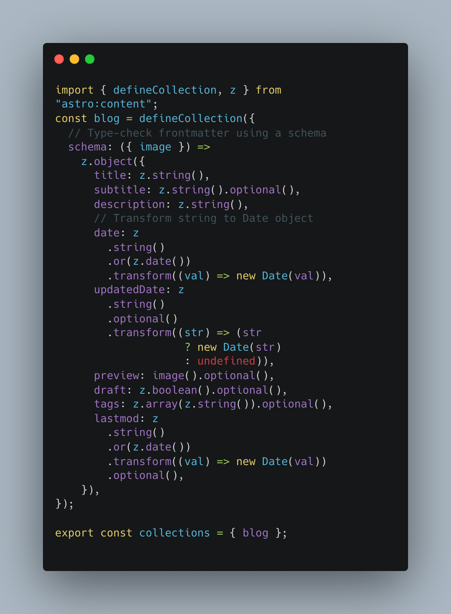

ก่อนหน้านี้ผมใช้ Gatsby.js ในการทำเว็บบล็อกส่วนตัว จุดเด่นก็คือมันเป็น React ที่ผมค่อนข้างถนัด และ build ออกมาเป็น Static Site ทำให้ Host ได้ฟรี หลังจากได้ลองเล่น Astro ดูก็เลยตัดสินใจย้ายเว็บไซต์ไปใช้ Astro แทน โดยเริ่มจากการทำความเข้าใจว่า Astro คืออะไร และทำงานอย่างไร

## Astro คืออะไร

Astro เป็น Static Site Generator ที่เขียนด้วยภาษา JavaScript และใช้เทคโนโลยีใหม่ๆ อย่าง [ES Modules](https://developer.mozilla.org/en-US/docs/Web/JavaScript/Guide/Modules) และ [Vite](https://vitejs.dev/) ในการทำงาน ทำให้เว็บไซต์ที่สร้างขึ้นมาด้วย Astro มีความเร็วในการโหลดสูง และสามารถใช้งานได้กับ [React](https://reactjs.org/), [Vue](https://vue.org), [Solid](https://solidjs.com) และ [Svelte](https://svelte.dev/) ได้ สามารถ[ดูรายชื่อ UI Framework ที่ Astro Support](https://docs.astro.build/en/guides/integrations-guide/#official-integrations)

## จุดเด่นของ Astro

โดยทั่วไปแล้ว Astro ก็เหมือนกับ Static Site Generator Framework เจ้าอื่นๆ อย่างเช่น Gatsby, Hugo, Jerkyll แต่สิ่งที่โดดเด่นของ Astro ที่ทำให้ผมตัดสินใจใช้ก็คือ ความเร็วในการ Build ไม่ว่าจะเป็น Production Build หรือ Development Fast Refresh ซึ่งเร็วมากๆ ช่วยให้ประสบการณ์การพัฒนาเว็บไซต์นั้นไหลลื่นและเร็วยิ่งขึ้น

อีกส่วนนึงก็คือ Astro เองมี Integration กับ UI Framework ต่างๆ เช่น React, Vue, Solidjs, Alpine, Svelete, Preact, หรือ Lit ทำให้เราสามารถ Reuse Components เก่าๆจากหลายๆโปรเจค ยกมาใช้ได้เลย

ทีเด็ดอีกอย่างก็คือ Image Optimization ของ Astro ทำได้ดีมากๆ ช่วย Resize และ Compress ให้ออกมาเท่าที่จำเป็น เพิ่มประสิทธิภาพในการโหลดเว็บขึ้นมหาศาล

ส่วนที่มีประโยชน์และช่วยป้องกันความผิดพลาดสำหรับเว็บที่ใช้ Markdown เป็น Base ในการเขียน Content ก็คือ Content Collections API ซึ่งช่วยให้เราสามารถกำหนด Collection type และเพิ่ม type-safe content ด้วย validation config ได้ด้วย ทำให้ระหว่างเราพัฒนาและเพิ่ม Content เราจะเจอ Error หรือ Warning ได้ทันที

## สรุป

ด้วย Structure ไม่ต่างจาก Project เดิมมากนัก ทำให้ผมสามารถย้ายของ Gatsby มาเป็น Astro ได้ไม่ยาก แถมเสริมด้วยความสามารถดีดีอย่าง collection type validation ก็ช่วยเพิ่มความมั่นใจได้เยอะมากๆ บวกความเร็วในการ Fast Refresh ก็ทำให้การพัฒนานั้นเร็วสุดๆ กดเซฟแล้วเห็นผลทันที

[ใครยังไม่เริ่มเล่น Astro ไปลองเล่นดูนะครับ!!!](https://astro.build/)

Happy Coding!
