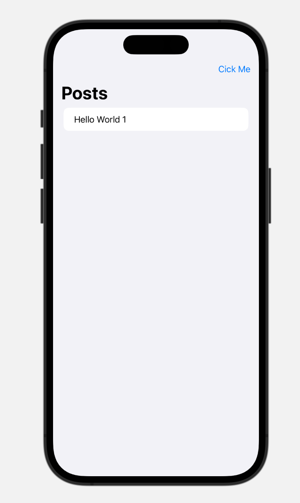

อยากเขียนแอพมือถือมาหลายปีแล้วแต่ไม่มีโอกาสสักที ตอนนี้มีไอเดียที่อยาก Prove ด้วย ถือโอกาสเริ่มเลยละกัน

นี่คือการเขียน iOS App ครั้งแรกของผม โคตรตื่นเต้น และก็ตื่นเต้นต่อไปเรื่อยๆ 55555

## โจทย์

ก่อนจะไปสร้างแอพอะไรยิ่งใหญ่อลังการ ด้วยสกิลเลเวล 0 ของเรา หาโจทย์ง่ายๆ มาลองทำความเข้าใจทั้งตัวภาษาและแพลตฟอร์มกันก่อน

- มี 1 หน้า แสดงรายการข้อมูลที่ได้จากการ Request API มา
- มีปุ่ม 1 ปุ่มสำหรับยิง Request API ใหม่

แค่นี้พอ 55555

## เตรียมตัวนิดหน่อย

อย่างที่เราตั้งโจทย์ไว้ เราอยากยิง API แล้วได้ข้อมูลเป็น List กลับมาแสดงผลเนอะ ซึ่งแน่นอนเราไม่เสียเวลาเซ็ทอัพ Backend เองอยู่แล้ว จึงขอใช้บริการ [JSONPlaceholder](https://jsonplaceholder.typicode.com/) ที่เป็น REST Server ที่มีข้อมูลหลายแบบให้เลือกใช้ โดยครั้งนี้ผมใช้ GET /posts ละกัน ประมาน 100 records กำลังดี

## เริ่มเลย!

ข้ามขั้นตอนการสร้างโปรเจคเลย ไปหากันเอาเอง

เราจะมาเริ่มที่ไฟล์ ContentView เลย (รีบ)

```swift
struct ContentView: View {
    var body: some View {
        VStack {
          Text("Hello, world!")
              .padding()
        }
    }
}
```

อันนี้มันคือ View ตั้งต้น เราไม่เอา ลบทิ้ง เพิ่มเป็นอย่างงี้เข้าไป

```swift
struct ContentView: View {
  let posts: [Post] = [
      Post(userId: 1, id: 1, title: "Hello World 1", body: "empty body"),
  ]

  var body: some View {
    NavigationView {
      List(posts) { post in
        Text(post.title)
      }
        .navigationTitle("Posts") // ใส่ชื่อหน้าจอ
        .toolbar { // ใส่ปุ่มบน toolbar
            Button(action: {}) {
                Text("Cick Me")
            }
        }
    }
  }
}
```

จะได้ UI หน้าตาเรียบๆ แบบนี้



แต่เรายังไม่ได้ยิง API ดึงข้อมูลมาใช้ และยังไม่ได้ทำให้ปุ่มทำงาน งั้นมาเริ่มกันเลย

ก่อนอื่นเราจะต้องสร้าง Model ของ Post ก่อน ผมมันคนขี้เกียจ ไปสร้าง struct ในไฟล์เดียวกันเลย

```swift
struct Post: Decodable, Identifiable {
  let userId: Int
  let id: Int
  let title: String
  let body: String
}
```

จากนั้นสร้าง class ที่ชื่อ PostManager ขึ้นมาเป็น type `ObservableObject` เพราะเราอยากให้คนอื่นสามารถ observe ได้นะ

```swift
class PostManager: ObservableObject {
  @Published var posts: [Post]?

}
```

เมื่อมี class Manager แล้ว เพิ่ม method `fetchPosts()` เข้าไปใน class นี้

```swift
class PostManager: ObservableObject {
  @Published var posts: [Post]?

  func fetchPosts() {
    // ยิง API ดึงข้อมูลมาใส่ใน posts
    if let url = URL(string: "https://jsonplaceholder.typicode.com/posts") {
        // create session
        let session = URLSession(configuration: .default)
        // give the session a task
        let task = session.dataTask(with: url) { data, response, error in
            if error != nil {
                print(error ?? "nothing")
                return
            }

            // create json decoder
            let decoder = JSONDecoder()
            do {
                // decode json
                let postDecoded = try decoder.decode([Post].self, from: data!)

                // update posts
                DispatchQueue.main.async {
                    self.posts = postDecoded
                }
            } catch {
                print(error)
            }
        }
        // start the task
        task.resume()
    }
  }
}
```

แล้วก็กลับไปแก้โค้ดที่ ContentView ให้เป็นแบบนี้

```swift
struct ContentView: View {
  @ObservedObject var postManager = PostManager()

  var body: some View {
    NavigationView {
      List(postManager.posts ?? []) { post in
        Text(post.title)
      }
    }
    .navigationTitle("Posts")
    .toolbar {
        Button(action: {
            postManager.fetchPosts()
        }) {
            Text("Cick Me")
        }
    }
  }
}
```

เท่านี้ เราก็จะได้หน้า List ที่มีปุ่มอยู่บน Toolbar เมื่อเรากดปุ่ม จะได้ข้อมูลจาก API มาแสดงผลใน List แล้ว

## สรุป

- ใช้ `@ObservedObject` เพื่อให้ View สามารถ observe ค่าใน class ที่เป็น `ObservableObject` ได้
- ใช้ `@Published` เพื่อให้ค่าใน class ที่เป็น `ObservableObject` สามารถเปลี่ยนแปลงค่าได้ และทำให้ View ที่ observe ค่านั้น ๆ ได้รับการอัพเดท
- ใช้ `URLSession` ในการยิง API
- ใช้ `JSONDecoder` ในการแปลงข้อมูลจาก JSON ให้เป็น Object ของ Swift
- ใช้ `List` แสดงข้อมูลในรูปแบบ List

โอเค รอบนี้เอาไว้เท่านี้ก่อน เพราะรู้สึกมึนๆกับ SwiftUI มากๆ และด้วย Style การเขียน Code ของภาษา Swift ที่ผมยังไม่ค่อยคุ้นชิน เดี๋ยวไว้ตอนหน้าจะลองเอาไปต่อ Firebase ดูดีมะ ลองทำ Login อะไรงี้ดู น่าจะมันส์

ฝากกดติดตามเพจที่ Facebook ด้วยนะครับ เพจชื่อ **anuwong.com** เหมือนกันเลย

Happy Coding ครับ
