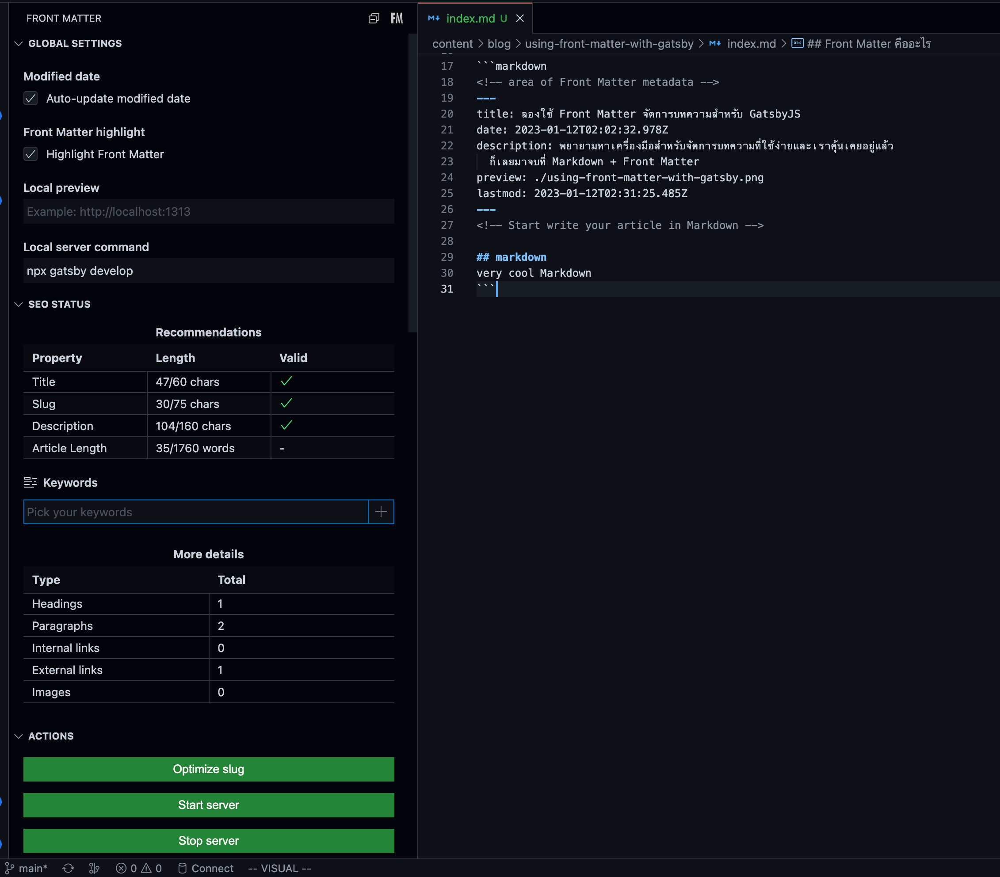

พยายามหาเครื่องมือสำหรับจัดการบทความที่ใช้ง่ายและเราคุ้นเคยอยู่แล้ว ก็เลยมาจบที่ Markdown + Front Matter ซึ่งโชคดีมากที่ Gatsby มี Starter Template ที่ Support Markdown อยู่แล้ว ก็เอามาใช้ต่อยอดได้เลยทันที

## Front Matter คืออะไร

[Front Matter](https://frontmatter.codes/docs#overview) คือเครื่องมือที่ใช้จัดการ Metadata ของ Markdown Article
ซึ่งเป็น format ที่ static site generator framework ต่างๆ มักจะเลือกใช้

```markdown
## <!-- area of Front Matter metadata -->

title: ลองใช้ Front Matter จัดการบทความสำหรับ GatsbyJS
date: 2023-01-12T02:02:32.978Z
description: พยายามหาเครื่องมือสำหรับจัดการบทความที่ใช้ง่ายและเราคุ้นเคยอยู่แล้ว
ก็เลยมาจบที่ Markdown + Front Matter
preview: /using-front-matter-with-gatsby.png
lastmod: 2023-01-12T02:31:25.485Z

---

<!-- Start write your article in Markdown -->

## markdown

very cool Markdown
```

ซึ่ง Front Matter จะมี VS Code Extension สำหรับช่วยเหลือเราในการ Editing ตัว Metadata ดังกล่าวใน file markdown ด้วย



อีกทั้งยังมีเมนูสำหรับจัดการ content เช่น สร้างบทความใหม่, draft บทความทิ้งไว้, ทำการ publish บทความ ก็สามารถทำทั้งหมดได้
ผ่าน Extension บน VS Code เสมือนเรามีระบบ CMS ติด VS Code เลย


เป็นยังไงกันบ้างกับความสามารถของเจ้า Front Matter VS Code Extension ผมอาจจะยังเขียนเล่าได้ไม่ดีเท่าไหร่ เพราะเพิ่งจะได้มาใช้ Markdown เขียนบทความจริงจัง
แต่เดี๋ยวไว้ในอนาคตจะมาอัพเดทอีกแน่นอน ขอบคุณครับ
